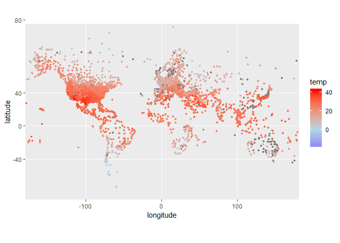

<!-- README.md is generated from README.Rmd. Please edit that file -->

# RMETAR

<!-- badges: start -->

[](https://travis-ci.org/jwijffels/RMETAR)
[](https://CRAN.R-project.org/package=RMETAR)
<!-- badges: end -->

The goal of RMETAR is to provide a METAR decoder for R users, connecting
to `mdsplib` (METAR Decoder Software Package Library -
<https://github.com/flightaware/mdsplib>)

## Installation

~~You can install the released version of RMETAR from
[CRAN](https://CRAN.R-project.org) with:~~

``` r
install.packages("RMETAR")
```

And the development version from [GitHub](https://github.com/) with:

``` r
# install.packages("remotes")
remotes::install_github("jwijffels/RMETAR")
```

## Obtaining METAR reports

Current and historical METAR data can be obtained from various places.
The current METAR report for a given airport is available at the
following URL where ‘{station}’ is the four-letter ICAO airport station
code.

    https://aviationweather.gov/metar/data?ids={station}

For example, you can find the METAR for London Heathrow (ICAO EGLL) at
<https://aviationweather.gov/metar/data?ids=egll>

You can also query the [NOAA data
service](https://aviationweather.gov/dataserver/example?datatype=metar),
where you can access METARS using search strings to retrieve data in XML
format

## METAR specifications

The [Federal Meteorological Handbook No.1.
(FMH-1 1995)](https://www.ofcm.gov/publications/fmh/FMH1/FMH1_2017.pdf),
which describes the U.S. standards, is available online at [ofcm
publications](https://www.ofcm.gov/publications/fmh/allfmh2.htm)

## Example

``` r
library(RMETAR)
```

``` r
metarcode <- "KSUU 240858Z AUTO 24018KT 10SM CLR 18/12 A2988 RMK AO2 SLPNO T01750124 58003 RVRNO"
result <- decodemetar(x = metarcode, printdecodedmetar=TRUE)
#> 
#> 
#> 
#> /*******************************************/
#> /*    THE DECODED METAR REPORT FOLLOWS     */
#> /*******************************************/
#> 
#> STATION ID          : KSUU
#> OBSERVATION DAY     : 24
#> OBSERVATION HOUR    : 8
#> OBSERVATION MINUTE  : 58
#> AUTO REPORT         : TRUE
#> WIND DIRECTION      : 240
#> WIND SPEED          : 18
#> WIND UNITS          : KT
#> PREVAIL VSBY (SM)   : 10.000
#> RVRNO               : TRUE
#> CLOUD COVER         : CLR
#> TEMP. (CELSIUS)     : 18
#> D.P. TEMP. (CELSIUS): 12
#> ALTIMETER (INCHES)  : 29.88
#> AUTO INDICATOR      : AO2
#> SLPNO               : TRUE
#> TMP2TENTHS (CELSIUS): 17.5
#> DPT2TENTHS (CELSIUS): 12.4
#> CHAR PRESS TENDENCY : 8
#> PRES. TENDENCY (hPa): 0.3
```

The decoded data is in a data frame with one row:

``` r
nrow(result)
#> [1] 1
ncol(result)
#> [1] 287
```

## Plotting

The package contains two built-in dataset with downloaded snapshots of:

  - `airports`
  - `airport_weather`

<!-- end list -->

``` r
library(ggplot2)
library(mapproj)
#> Loading required package: maps

# decode metar in airport_weather
decoded <- lapply(airport_weather$metar, decodemetar)

# extract stnid and temperature
summary <- lapply(
  decoded, 
  function(x)x[, c("stnid", "temp")]
)

# rbind into a data frame
summary <- do.call(rbind, summary)

# merge with airports
dat <- merge(airports, summary, by.x = "gps", by.y = "stnid", all.y = TRUE)

# discard airports with missing values for lat and lon
dat <- dat[!is.na(dat$longitude) & !is.na(dat$latitude) & dat$latitude > -80, ]

# plot
ggplot(dat, aes(x = longitude, y = latitude, col = temp)) +
  geom_point(size = 1) +
  scale_color_gradient2(low = "blue", high = "red", mid = "lightblue") +
  coord_map()
```


